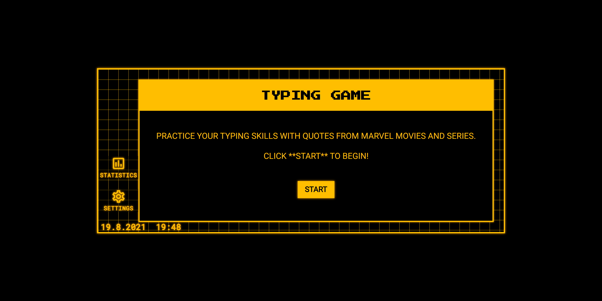

# Typing Game

This is a solution to the [Event-Driven Programming - Build a Typing Game](https://github.com/dalvinderjitsingh/Web-Dev-For-Beginners/tree/main/4-typing-game) challenge from [Web Development for Beginners - A Curriculum](https://github.com/microsoft/Web-Dev-For-Beginners) by Azure Cloud Advocates at Microsoft.

## Table of contents

- [Overview](#overview)
  - [The challenge](#the-challenge)
  - [Screenshot](#screenshot)
  - [Links](#links)
- [My process](#my-process)
  - [Built with](#built-with)
  - [What I learned](#what-i-learned)
  - [Continued development](#continued-development)
  - [Useful resources](#useful-resources)
- [Author](#author)
- [Acknowledgments](#acknowledgments)

## Overview

### The challenge

Add more functionality.

- Disable the input event listener on completion, and re-enable it when the button is clicked.
- Disable the textbox when the player completes the quote.
- Display a modal dialogue box with the success message.
- Store high scores using localStorage.

### Screenshot

### Links

- Web Development for Beginners - A Curriculum by Azure Cloud Advocates at Microsoft URL: [https://github.com/microsoft/Web-Dev-For-Beginners](https://github.com/microsoft/Web-Dev-For-Beginners)
- Live Site URL: [https://dalvinderjitsingh.github.io/typing-game](https://dalvinderjitsingh.github.io/typing-game)

## My process

### Built with

- Semantic HTML5 markup
- CSS custom properties
- Flexbox
- CSS Grid
- JavaScript
- [Google Fonts](https://fonts.google.com/)
- [Material Icons](https://fonts.google.com/icons)
- [Emoji as Favicon](https://emojipedia.org/keyboard/)

### What I learned

While working through this project, I learned how to use JavaScript Closures. How to add, read and remove data items from the localStorage. How to use the JavaScript Date objects to get the current date, time, and calculate elapsed time. And how to create modal boxes.

### Continued development

Areas that I would want to continue focusing on in future projects includes other storage methods like sessionStorage, CacheStorage, IndexedDB, etc.

### Useful resources

- [Closures](https://developer.mozilla.org/en-US/docs/Web/JavaScript/Closures) - This is a resource I'd recommend to anyone who wants to learn about JavaScript Closures.
- [JavaScript Date Objects](https://developer.mozilla.org/en-US/docs/Web/JavaScript/Reference/Global_Objects/Date) - This is a resource I'd recommend to anyone who wants to learn about JavaScript Date objects.
- [localStorage](https://developer.mozilla.org/en-US/docs/Web/API/Window/localStorage) - This is a resource I'd recommend to anyone who wants to learn about localStorage.
- [Modal Box](https://www.w3schools.com/howto/howto_css_modals.asp) - This is a resource I'd recommend to anyone who wants to learn how to create Modal boxes.

## Author

- Name - Dalvinderjit Singh
- Website - [dalvinderjitsingh.github.io](https://dalvinderjitsingh.github.io/)
- LinkedIn - [Dalvinderjit Singh](https://www.linkedin.com/in/dalvinderjit-singh-a40b511b7/)
- Twitter - [@dalvinderjit01](https://twitter.com/dalvinderjit01)

## Acknowledgments

I want to thank all the people involved in creating Web Development for Beginners - A Curriculum. This challenge was a great learning experience.

And thanks to all the people who created the resources utilised in the development of this project.
